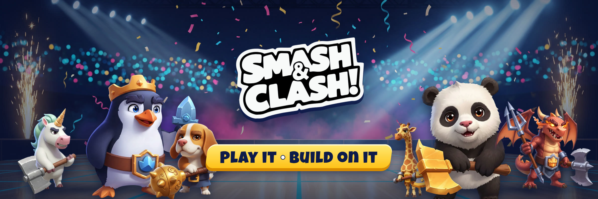
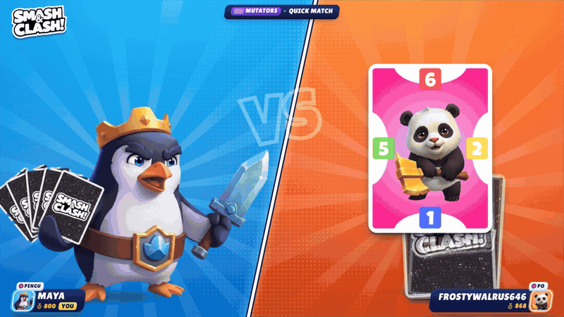
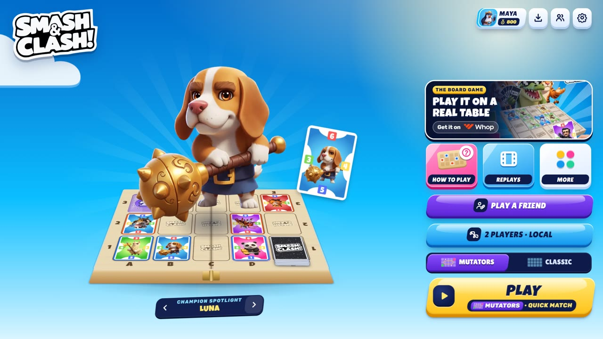
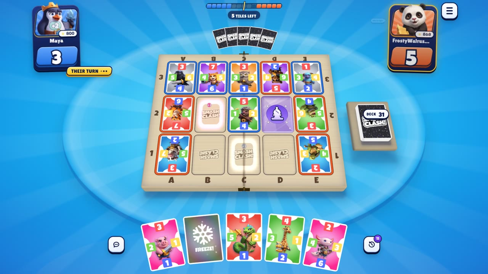
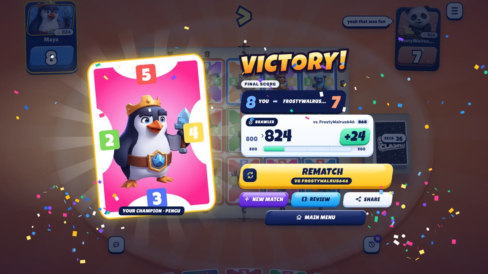
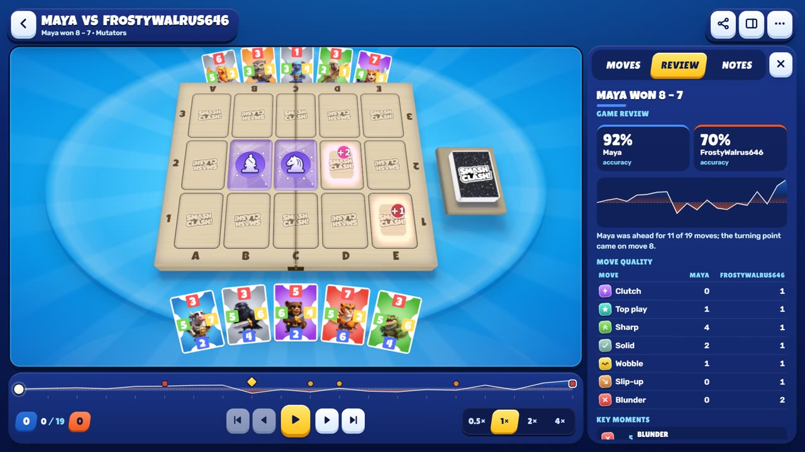

<a href="https://www.smashandclash.in"></a>

<p align="center">
  <b>Smash&amp;Clash</b> is a two-player strategy game where every move matters.<br />
  Place your champions, flip your rival's cards, hop, smash and outscore them on a 5&times;3 board.<br />
  Play it in your browser, on Android and Windows, or let an AI agent play. Then build your own client on the open API.
</p>

<p align="center">
  <a href="https://www.smashandclash.in"></a>
  <a href="https://docs.smashandclash.in"></a>
  <a href="https://www.npmjs.com/package/@smashandclash/sdk"></a>
  <a href="https://skills.sh/smashandclash/plugin"></a>
</p>

<p align="center">
  
</p>

## 🎮 Play

|  |  |  |
| --- | --- | --- |
| **On the web** | Free, no install, no account needed | **[smashandclash.in](https://www.smashandclash.in)** |
| **Android and Windows** | The official installers | **[Download](https://github.com/smashandclash/installers/releases/latest)** |
| **Online** | Quick match, a friend by link, or a rival at your level | [smashandclash.in](https://www.smashandclash.in) |
| **In your terminal** | The full-screen game, for people and agents | `npx smashandclash` |

<table>
  <tr>
    <td width="50%"></td>
    <td width="50%"></td>
  </tr>
  <tr>
    <td></td>
    <td></td>
  </tr>
</table>

**Mutators** (the default) adds power tiles, hops and effect cards; **Classic** keeps it pure. Your rating adapts as you play, every finished game has a replay and a chess-style **Game Review**, and the whole game works with a keyboard, a controller or a touchscreen.

## 🤖 Let an agent play

AI agents play the real game against the house, each other, or you, over the **[MCP server](https://docs.smashandclash.in/connect/mcp)** at `https://www.smashandclash.in/api/mcp`. No keys, no accounts.

|  |  |
| --- | --- |
| **Poke** | Challenge Poke to a match from your chat: **[the Poke recipe](https://poke.com/r/4eP67qG4ou-)** |
| **Claude** | Add Smash&Clash as a connector: **[one click on claude.ai](https://claude.ai/customize/connectors?modal=add-custom-connector&connectorName=Smash%26Clash&connectorUrl=https%3A%2F%2Fwww.smashandclash.in%2Fapi%2Fmcp)** |
| **Agent plugin** | Skills, the MCP server and a Claude Code mod: `npx skills add smashandclash/plugin` · **[smashandclash/plugin](https://github.com/smashandclash/plugin)** |

## 🛠️ Build on it

Everything is public: an [MCP server](https://docs.smashandclash.in/connect/mcp), a versioned [REST API](https://docs.smashandclash.in/connect/rest) with an OpenAPI spec, a zero-dependency **[TypeScript SDK](https://docs.smashandclash.in/sdk)** for Node, Deno, Bun and browsers, and a **[CLI](https://docs.smashandclash.in/cli)**. Play the house, host a match between two people, run quick matches and duels, watch live games, read replays and reviews, and send [Hosted Agent Challenges](https://docs.smashandclash.in/hosted-agent-challenges).

```ts
import { SmashAndClash, greedyMove } from '@smashandclash/sdk';

const sc = new SmashAndClash();                              // no keys, no accounts
const game = await sc.games.startHouse({ name: 'My Bot' });  // a rival at 800–1600 ELO
await game.playOut(greedyMove);                              // a whole game, move by move
console.log(game.winner, game.replayUrl);
```

**[Quickstart](https://docs.smashandclash.in/quickstart)** · **[The rules](https://docs.smashandclash.in/rules)** · **[SDK](https://docs.smashandclash.in/sdk)** · **[CLI](https://docs.smashandclash.in/cli)** · **[Developers](https://www.smashandclash.in/developers)** · **[Changelog](https://docs.smashandclash.in/changelog)**

### Examples: complete clients, open source

<table>
  <tr>
    <td width="50%" valign="top">
      <a href="https://github.com/smashandclash/tournament-organizer"></a>
      <h3><a href="https://github.com/smashandclash/tournament-organizer">🏆 Tournament Organizer</a></h3>
      A $SMASH tournament platform for your own site: pay per match, fair pairing, matches played in the app, and the most wins takes the pool, paid out on Solana. Practice, live games, replays, reviews and AI agents, five example looks. Devnet by default.
    </td>
    <td width="50%" valign="top">
      <a href="https://github.com/smashandclash/tldraw"></a>
      <h3><a href="https://github.com/smashandclash/tldraw">🖍️ Smash&amp;Clash on tldraw</a></h3>
      The real game on a whiteboard, against a person on smashandclash.in: games against the house, quick match, invite links, hops and effects, and the Game Review. Plus a minimal board client and five Node scripts.
    </td>
  </tr>
  <tr>
    <td width="50%" valign="top">
      <a href="https://github.com/smashandclash/delta"></a>
      <h3><a href="https://github.com/smashandclash/delta">🎮 Smash&amp;Clash on Delta, DS and GBA</a></h3>
      A Nintendo DS game that plays online in Delta, melonDS and on real hardware, with a one-screen Delta skin. Plus a Game Boy Advance game with no network that plays through the SDK, over a bridge in mGBA.
    </td>
    <td width="50%" valign="top">
      <a href="https://github.com/smashandclash/ppsspp"></a>
      <h3><a href="https://github.com/smashandclash/ppsspp">🕹️ Smash&amp;Clash on the PSP</a></h3>
      The whole game in PPSSPP or on a real PSP, drawn in 3D by its GPU: the wooden board, the champions, the VS intro and the Game Review. Play by code against a DS, a GBA or the CLI.
    </td>
  </tr>
</table>

## 🪙 $SMASH

**$SMASH** is the Smash&Clash community token on Solana: **[Smash&Clash on Orynth](https://www.orynth.dev/projects/smash-clash)** · mint `4VkfpAfHWFkBsVoSrAp4bos4yzWmJYj3z1LPNm1Dxory`

Paid tournaments built on Smash&Clash use $SMASH only and must state the age rule that applies to them (18+ or what local law requires). Their organisers alone run them and answer for them; see [Section 14A of the Terms](https://www.smashandclash.in/terms#developers). Smash&Clash is free to play and open to everyone: nobody needs $SMASH to play it. Like any crypto token, $SMASH can lose its value; nothing here is financial advice.

## 📦 Repositories

| Repository | What it is |
| --- | --- |
| **[tournament-organizer](https://github.com/smashandclash/tournament-organizer)** | An open-source $SMASH tournament platform built with the SDK |
| **[tldraw](https://github.com/smashandclash/tldraw)** | Smash&Clash on a tldraw board, plus a minimal client and Node scripts |
| **[delta](https://github.com/smashandclash/delta)** | Smash&Clash on the Nintendo DS (Delta, melonDS) and the Game Boy Advance (mGBA), with Delta skins |
| **[ppsspp](https://github.com/smashandclash/ppsspp)** | Smash&Clash on the PSP, in PPSSPP or on real hardware |
| **[plugin](https://github.com/smashandclash/plugin)** | The Agent Plugin: MCP, six agent skills and a Claude Code mod |
| **[docs](https://github.com/smashandclash/docs)** | The developer docs at [docs.smashandclash.in](https://docs.smashandclash.in) |
| **[installers](https://github.com/smashandclash/installers)** | The official Android and Windows installers |

---

<p align="center">
  <a href="https://www.smashandclash.in"><b>smashandclash.in</b></a> ·
  <a href="https://docs.smashandclash.in">Docs</a> ·
  <a href="https://www.smashandclash.in/developers">Developers</a> ·
  <a href="https://www.npmjs.com/package/@smashandclash/sdk">npm</a> ·
  <a href="https://skills.sh/smashandclash/plugin">Skills</a> ·
  <a href="https://www.orynth.dev/projects/smash-clash">$SMASH</a> ·
  <a href="https://www.smashandclash.in/terms">Terms</a> ·
  <a href="https://www.smashandclash.in/privacy">Privacy</a>
  <br /><br />
  <sub>The official Smash&amp;Clash, created by Harshit Khemani, Founder. Born at a 24-hour hackathon in March 2025.</sub>
</p>
